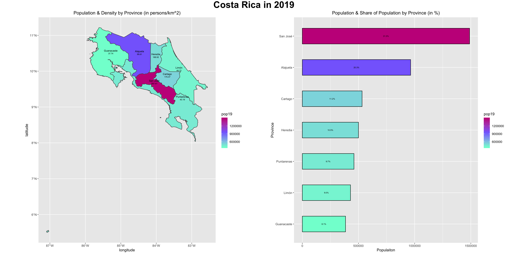
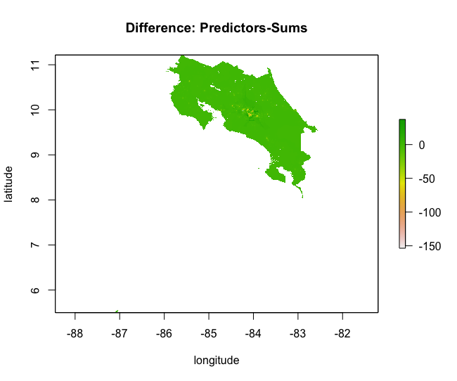
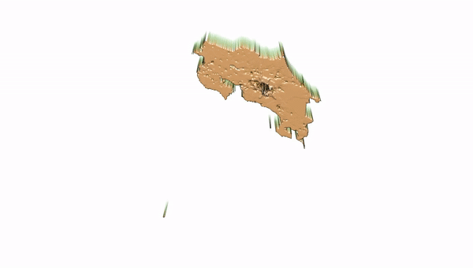
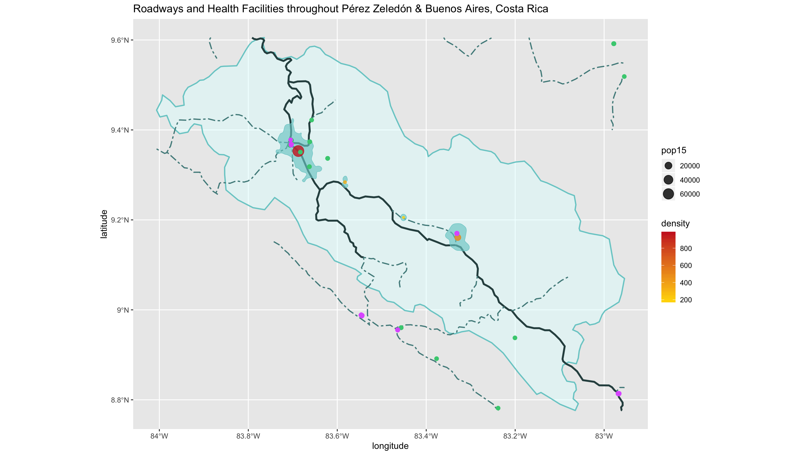
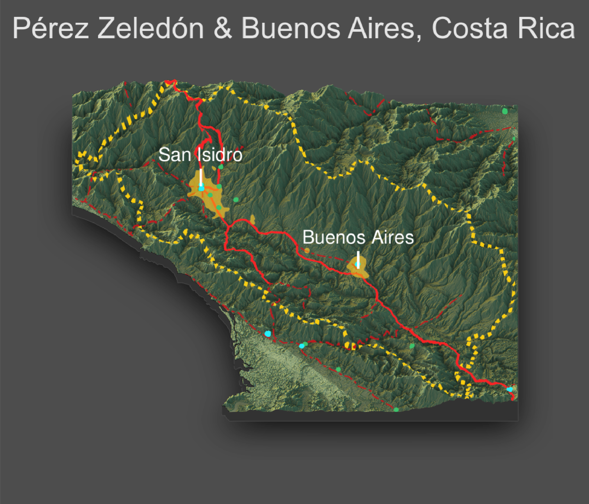

# Geospatial Analysis of Costa Rica

Costa Rica is located in Central America and is comprised of 51,100 square kilometers of land. The country is bordered by Nicaragua to the north and Panama to the south. Additionally, it is situated between the Caribbean Sea (along the 185 mile northeastern coastline) and the Pacific Ocean (along the 630 mile southwestern coastline). 

## Political Subdivisions of Costa Rica

Costa Rica is composed of provinces, cantons, and districts. Within Costa Rica, there are 7 provinces, each composed of a series of cantons (totaling to 81 cantons throughout the country). Each of these cantons are then further divided into districts (totaling to 473 districts country wide). 

The map above provides a general overview of the country’s provinces, along with a more specified view of two: the provinces of Guanacaste and Limón. (Due to the influence of tourism in both of these areas, I was hoping to focus on these provinces for later analysis. However, due to their high population numbers, I had to select different areas for subsequent analysis.)

## Population Distribution of Costa Rica

The above maps illustrate the population distribution of Costa Rica. The first set of plots illustrates how the population of Costa Rica is spread throughout the country, and the 3D plot shows the log of population by canton (with a higher position indicating a larger log of population).The population of the country is largely focused in the province of San José, which houses the capital city. The other higher levels of population are located throughout the north region of the country; this is likely due to the fact that the northern beaches are very popular for tourism, leading to many workers and srvices focused in this area.
 
## Modeling the Population of Costa Rica

To begin my attempt at modeling Costa Rica’s population, I began by collecting many different types of data on the country as a whole. This included data surrounding the night-time lights of the area, the distance to water sources, topographical data, slope of the land, etc. By collaborating all of these attributes (and going through some logistical processes to adjust the data's format), I was able to make a model of the country’s population based on these geospatial covariates. I found that the most convincing correlation was made when all available variables were utilized in a combined model, resulting in an r-squared value of about .83. (The graph above is an illustration of this combined model.) 

By far the most predictive single variable was night-time lights. Utilizing this attribute alone still provided a strong r-squared value of about 0.79. The resulting model for this variable is shown above, along with a simple map showing the illustration of night-time lights throughout the country. Comparing this map to the political boundaries, one can notice a fixation of lights focused around the region of the capital city, San Jose. Upon noticing this association, it was interesting to perform further analysis on the distribution of night-time lights throughout the country. The histogram below shows density as a function of night-time lights, and it can be seen that a few cities fall well above the norm of light present. One of these cities is likely the capital.

To further my analysis of Costa Rica’s population modeling, I created three final models. The first two models used the population of the country as the response variable and some variation of the geospatial covariates as the predictors. One model used the sum of these covariates, and one used the mean of each covariate. The final model also used the mean as a predictor but employed the log of the population as the response variable. A table comparing the vital determinants of accuracy for each model is shown below. (The sum of absolute differences is a summation of all individual differences between predicted values and the actual values throughout the country.) 

| **Model**        | **Sum of Absolute Differences**| **Adjusted R-Squared Value**  |
| ---------------- |:------------------------------:| -----------------------------:|
| Sums             | 4,664,191                      | .8009                         |
| Means            | 4,559,883                      | .01015                        |
| Log of Population| 4,643,811                      | .07743                        |

Although none of these models were perfect in their predictions of Costa Rica’s population distribution, in comparison, the sum model would be considered the most accurate in my eyes. (The map below is a visual representation of the difference of model vs. reality for the sum models along with a 3D visual as well.) The sum model did accumulate the largest sum of absolute differences; however, the variance among the models in terms of the sums of their absolute differences varied by less than 3% of each other. Meanwhile, the differences between the models’ r-squared values are much more intense. The mean and log of population models resulted in r-squared values that show almost no correlation between the actual population data and the model’s regression.; however, the sum model resulted in a strong r-squared value. Overall, I believe that the large difference in r-squared values between the models is a better indicator than the smaller differences between the absolute error sums. With a unique population distribution in Costa Rica (resulting from poverty, overpopulation, tourism, geography, etc.), I believe that the summation model is the best model due to its assumed ability to better align with the country’s unique population trends as a result of its elevated r-squared value. 

## Description of Human Settlements, Roadways and Health Care Facilities throughout the Provinces of Pérez Zeledón and Buenos Aires

### Human Settlements

The population of Buenos Aires is about 48,800 people, and the population of Pérez Zeledón is approximately 142,000 people. This gives an overall population of 190,800 people for the combined adm3 areas. There are two main urban areas: one centered around the city of San Isidro in the canton of Pérez Zeledón and the other centered around the city of Buenos Aires in the canton of Buenos Aires. In addition, there are two small village-sized towns situated along the main road in between these two urban centers.

Overall, the density and size of human settlements is an indication of the nature of the urban area, in terms of its identification of a city, town, etc., the services that it provides, and the infrastructure it holds. The map identifies four urban areas throughout the combined cantons. The area around the city of San Isidro in the northwest is by far the largest and densest of the four. Particularly, it is showing a population of about 50-60 thousand people with a density near 1000 people per square kilometer, likely indicating a well-established, intense urban center. The second largest urban focus is located east of central within the combined area. This area has a population of nearly 20,000 people and a density around 500 people per square kilometer. Although not as large of an urban area as San Isidro, these measurements would still indicate that Buenos Aires is a built-up, central city. Besides these larger urban areas, two small villages exist along the primary road in the center of the combined area. These villages have a density around 200 people per square kilometer and a size below 10,000 people. Both areas are likely established settlements but will not maintain the same level of infrastructure and services present in larger urban areas.

### Roadways

In regard to transportation, the area appears to serve its constituents well. All of the urban areas, representing large foci of people, are interconnected with the primary road, providing access between these centers of population, services, and infrastructure. Additionally, many of the secondary roads sprawl out to encompass anyone living in the more rural areas around the city, giving them access to the urban centers. The only areas with a blatant lack of roads are those lying along the northern border of the combined area. However, much of this area is mountainous, making it difficult to travel over and much sparser in terms of population. Therefore, overall, I believe that the transportation infrastructure in place allows for the movement of people between most areas of human settlement, whether urban or rural.

### Health Care Facilities

In regard to health care facilities, the combined area could certainly grant more convenient access to the constituents. Particularly, the Buenos Aires canton is lacking in its accessibly for health care. Many of the hospitals (depicted as purple dots) and the clinics (depicted as green dots) are centered around the main urban areas. While these facilities are very accessible to the large number of urban residents, they are not spatially convenient for many of those living in the rural areas. For those living along the border of the combined administrative areas, a long drive could cause trouble if in need of immediate medical attention. 

For the Buenos Aires canton, this is a particularly large problem given that there is only one clinic to serve the entire eastern part of the administrative district. Anyone in need of more intense care would have to be transported to the single hospital located in the city, which could be over an hour away for some living on the outskirts. The potential for medical care should not be something that requires a long drive; the closer a medical facility is to a constituent, the greater their access to medical care and the lower the risk of complications due to lengthy travel. Additionally, the map does not even depict the entirety of the medical crisis in this area. The Buenos Aires canton is one of the most impoverished regions of Costa Rica. The one hospital located in this region lacks much of the infrastructure and equipment to address basic medical concerns, such as childbirth. Therefore, most mothers have to attempt the long, grueling drive to San Isidro while in labor. This endangers the child’s and the mother’s life due to the large number of births on the road and leads to an unproportionally high number of births registered in the Pérez Zeledón canton. As a result, the funding for this region is increased, leaving Buenos Aires even further beyond in poverty and worsening their outlook for improved medical care. Increasing the accessibility of health care in this area would not only make those in rural areas safer, but hopefully help to avoid concerns such as this.

### Topography's Impact

In general, most people in Costa Rica prefer to live at a moderate latitude. They avoid oxygen-deprived, cumbersome mountain peaks and also refrain from living in valleys with the potential of flooding in a rainforest climate. Given that many people in this area are mostly farmers, neither of these extremes would be beneficial for business. As far as transportation, road routes largely fall in the valleys. This would ease construction given that it allows for the lowest amount of land resurfacing. Roads are also easier to use if spread across flat land rather than rough terrain. Finally, health care facilities are indirectly affected by topography due to their reliance on human settlements and roadways; they must located in areas with population and road access. (The map above displays urban centers, roadways, and health centers overlaid over topography.)

## Overview Table

| **Urban Populations**           | **Roadways**                    | **Healthcare Facilities**     |
| ------------------------------- |:-------------------------------:| -----------------------------:|
| # : 4                           |# of primary: 14                 |#:88                           |  
|Largest population: 13,684 people|# of secondary: 23               |# of people per facility: 2,168|
|                                 |Length of roads: 576,396.6 meters|                               |

This table gives the specifics of the Pérez Zeledón & Buenos Aires provinces for the areas disscussed above.
