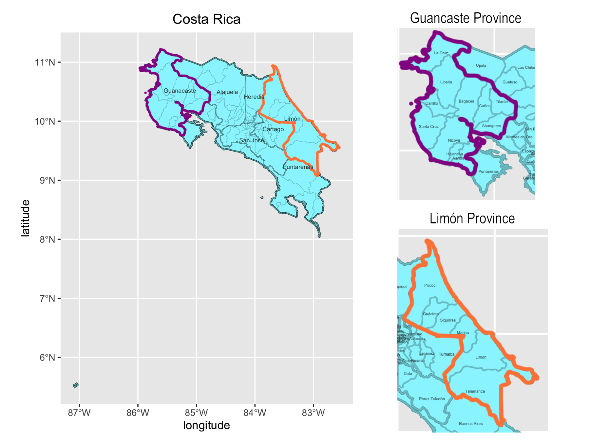
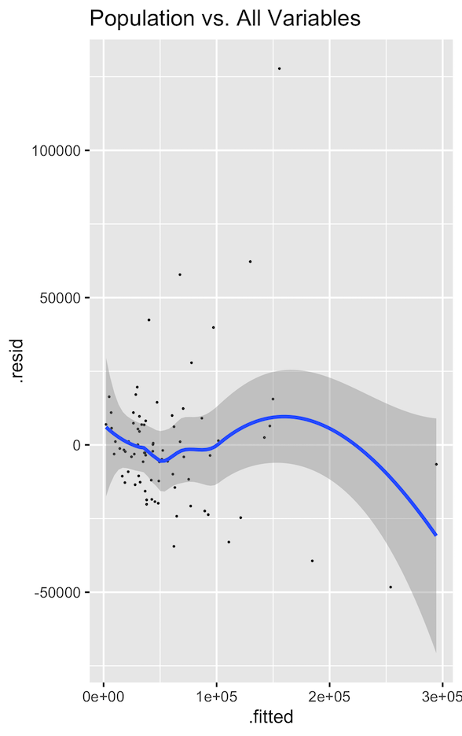
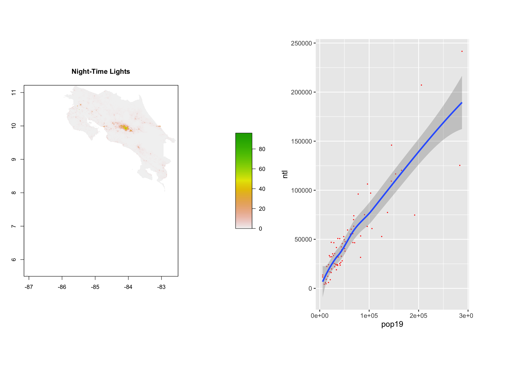
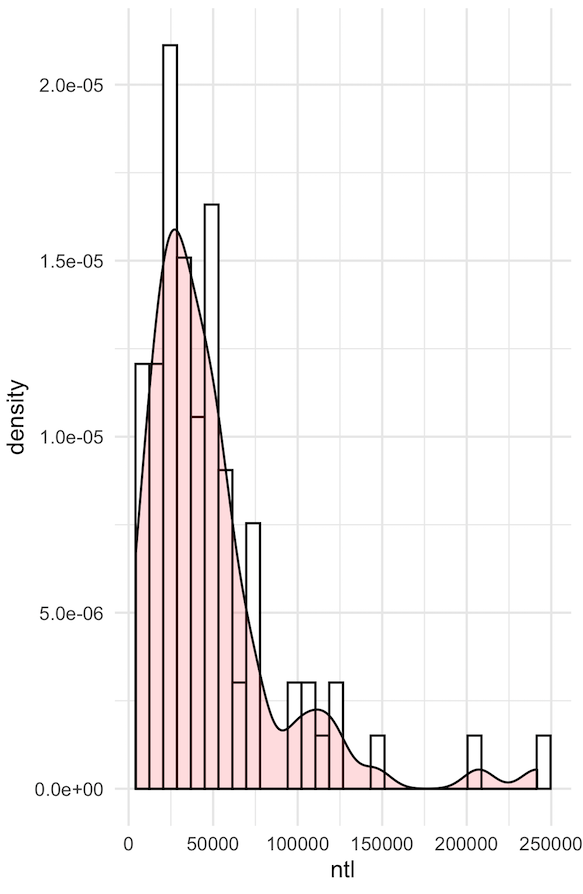

# Geospatial Analysis of Costa Rica

Costa Rica is located in Central America, comprised of 51,100 square kilometers of land. The country is bordered by Nicaragua to the north and Panama to the south. Additionally, it is situated between the Caribbean Sea (along the 185 mile northeastern coastline) and the Pacific Ocean (along the 630 mile southwestern coastline). 

## Political Subdivisions of Costa Rica

Costa Rica is composed of provinces, cantons, and districts. Within Costa Rica, there are 7 provinces each composed of a series of cantons, totaling to 81 cantons throughout the country. Each of these cantons are then further divided into districts (totaling to 473 districts country wide). 

The map above provides a general overview of the country’s provinces, along with a more specified view of two: the provinces of Guanacaste and Limón. (Due to the influence of tourism in both of these areas, I was hoping to focus on these provinces for later analysis. However, due to their high population numbers, I had to select different areas for subsequent analysis.)

## Modeling the Population of Costa Rica

To begin my attempt at modeling Costa Rica’s population, I began by collecting many different types of data on the country as a whole. This included data surrounding the nigh-time lights of the area, the distance to water sources, topographical data, slope of the land, etc. By collaborating all of these attributes (and going through some logistical processes to adjust the data’s format), I was able to make a model of the country’s population based on these geospatial covariates. I found that the most convincing correlation was made when all available variables were utilized in a combined model, resulting in an r-squared value of about .83. (The graph above is an illustration of this combined model.) 

By far the most predictive single variable was night-time lights. Utilizing this attribute alone still provided a strong r-squared value of about 0.79. The resulting model for this variable is shown above, along with a simple map showing the illustration of nigh-time lights throughout the country. Comparing this map to the political boundaries, one can notice a fixation of lights focused around the region of the capital city, San Jose. Upon noticing this association, it was interesting to perform further analysis on the distribution of night-time lights throughout the country. The histogram below shows density as a function of night-time lights, and it can be seen that a few cities fall well above the norm of light present. One of these cities is likely the capital.

